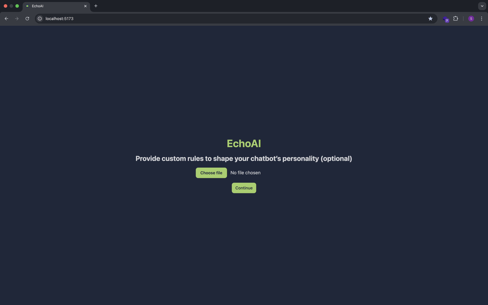

# AI_Chatbot

Here is an image of how it looks like:



Check out a quick demo of the AI chatbot in action:
[Watch the demo video](https://vimeo.com/1130986268?share=copy&fl=sv&fe=ci#t=0)

Customize your chatbot with your own policy to turn it into a dedicated customer assistant.
Watch the demo video below to see it in action:
[Watch how to personalize your chatbot](https://vimeo.com/1131423195?share=copy&fl=sv&fe=ci#t=0)

To install dependencies:

```bash
bun install
```

To run:

```bash
bun run dev
```

This project was created using `bun init` in bun v1.2.23. [Bun](https://bun.com) is a fast all-in-one JavaScript runtime.
